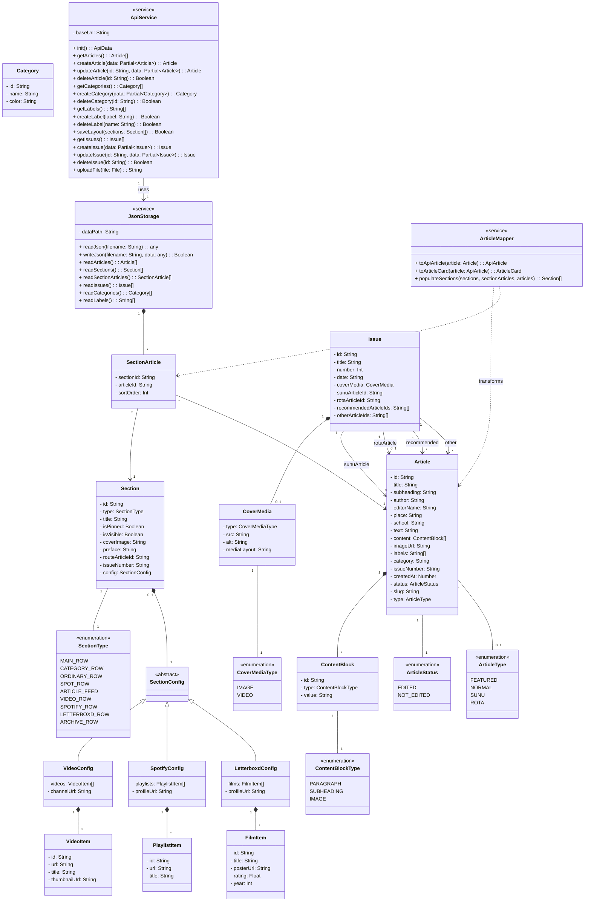

# Diyagram 1 — Veri Modelleri & Backend

```mermaid
classDiagram

%% ========================================
%% CORE DATA MODELS
%% ========================================

class Article {
    - id: String
    - title: String
    - subheading: String
    - author: String
    - editorName: String
    - place: String
    - school: String
    - text: String
    - content: ContentBlock[]
    - imageUrl: String
    - labels: String[]
    - category: String
    - issueNumber: String
    - createdAt: Number
    - status: ArticleStatus
    - slug: String
    - type: ArticleType
}

class ArticleStatus {
    <<enumeration>>
    EDITED
    NOT_EDITED
}

class ArticleType {
    <<enumeration>>
    FEATURED
    NORMAL
    SUNU
    ROTA
}

class ContentBlock {
    - id: String
    - type: ContentBlockType
    - value: String
}

class ContentBlockType {
    <<enumeration>>
    PARAGRAPH
    SUBHEADING
    IMAGE
}

class Category {
    - id: String
    - name: String
    - color: String
}

class Section {
    - id: String
    - type: SectionType
    - title: String
    - isPinned: Boolean
    - isVisible: Boolean
    - coverImage: String
    - preface: String
    - routeArticleId: String
    - issueNumber: String
    - config: SectionConfig
}

class SectionType {
    <<enumeration>>
    MAIN_ROW
    CATEGORY_ROW
    ORDINARY_ROW
    SPOT_ROW
    ARTICLE_FEED
    VIDEO_ROW
    SPOTIFY_ROW
    LETTERBOXD_ROW
    ARCHIVE_ROW
}

class SectionArticle {
    - sectionId: String
    - articleId: String
    - sortOrder: Int
}

class SectionConfig {
    <<abstract>>
}

class VideoConfig {
    - videos: VideoItem[]
    - channelUrl: String
}

class VideoItem {
    - id: String
    - url: String
    - title: String
    - thumbnailUrl: String
}

class SpotifyConfig {
    - playlists: PlaylistItem[]
    - profileUrl: String
}

class PlaylistItem {
    - id: String
    - url: String
    - title: String
}

class LetterboxdConfig {
    - films: FilmItem[]
    - profileUrl: String
}

class FilmItem {
    - id: String
    - title: String
    - posterUrl: String
    - rating: Float
    - year: Int
}

class CoverMedia {
    - type: CoverMediaType
    - src: String
    - alt: String
    - mediaLayout: String
}

class CoverMediaType {
    <<enumeration>>
    IMAGE
    VIDEO
}

class Issue {
    - id: String
    - title: String
    - number: Int
    - date: String
    - coverMedia: CoverMedia
    - sunuArticleId: String
    - rotaArticleId: String
    - recommendedArticleIds: String[]
    - otherArticleIds: String[]
}

%% ========================================
%% BACKEND API & STORAGE
%% ========================================

class ApiService {
    <<service>>
    - baseUrl: String

    + init(): ApiData
    + getArticles(): Article[]
    + createArticle(data: Partial~Article~): Article
    + updateArticle(id: String, data: Partial~Article~): Article
    + deleteArticle(id: String): Boolean
    + getCategories(): Category[]
    + createCategory(data: Partial~Category~): Category
    + deleteCategory(id: String): Boolean
    + getLabels(): String[]
    + createLabel(label: String): Boolean
    + deleteLabel(name: String): Boolean
    + saveLayout(sections: Section[]): Boolean
    + getIssues(): Issue[]
    + createIssue(data: Partial~Issue~): Issue
    + updateIssue(id: String, data: Partial~Issue~): Issue
    + deleteIssue(id: String): Boolean
    + uploadFile(file: File): String
}

class JsonStorage {
    <<service>>
    - dataPath: String

    + readJson(filename: String): any
    + writeJson(filename: String, data: any): Boolean
    + readArticles(): Article[]
    + readSections(): Section[]
    + readSectionArticles(): SectionArticle[]
    + readIssues(): Issue[]
    + readCategories(): Category[]
    + readLabels(): String[]
}

class ArticleMapper {
    <<service>>

    + toApiArticle(article: Article): ApiArticle
    + toArticleCard(article: ApiArticle): ArticleCard
    + populateSections(sections, sectionArticles, articles): Section[]
}

%% ========================================
%% RELATIONSHIPS
%% ========================================

Article "1" *-- "*" ContentBlock
Article "1" -- "1" ArticleStatus
Article "1" -- "0..1" ArticleType
ContentBlock "1" -- "1" ContentBlockType

Section "1" -- "1" SectionType
Section "0..1" *-- "1" SectionConfig
SectionConfig <|-- VideoConfig
SectionConfig <|-- SpotifyConfig
SectionConfig <|-- LetterboxdConfig
VideoConfig "1" *-- "*" VideoItem
SpotifyConfig "1" *-- "*" PlaylistItem
LetterboxdConfig "1" *-- "*" FilmItem

SectionArticle "*" --> "1" Section
SectionArticle "*" --> "1" Article

Issue "1" *-- "0..1" CoverMedia
Issue "1" --> "0..1" Article : sunuArticle
Issue "1" --> "0..1" Article : rotaArticle
Issue "1" --> "*" Article : recommended
Issue "1" --> "*" Article : other
CoverMedia "1" -- "1" CoverMediaType

JsonStorage "1" *-- "*" SectionArticle
ApiService "1" --> "1" JsonStorage : uses
ArticleMapper ..> Article : transforms
ArticleMapper ..> SectionArticle : uses
```
