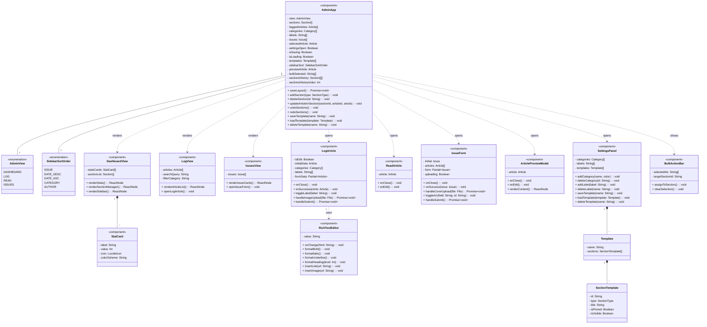

# Diyagram 2 — Admin Panel

```mermaid
classDiagram

%% ========================================
%% MAIN STATE
%% ========================================

class AdminApp {
    <<component>>
    - view: AdminView
    - sections: Section[]
    - loggedArticles: Article[]
    - categories: Category[]
    - labels: String[]
    - issues: Issue[]
    - selectedArticle: Article
    - settingsOpen: Boolean
    - isSaving: Boolean
    - isLoading: Boolean
    - templates: Template[]
    - sidebarSort: SidebarSortOrder
    - previewArticle: Article
    - bulkSelected: String[]
    - sectionsHistory: Section[][]
    - sectionsHistoryIndex: Int

    + saveLayout(): Promise~void~
    + addSection(type: SectionType): void
    + deleteSection(id: String): void
    + updateArticleInSection(sectionId, articleId, article): void
    + undoSections(): void
    + redoSections(): void
    + saveTemplate(name: String): void
    + loadTemplate(template: Template): void
    + deleteTemplate(name: String): void
}

class AdminView {
    <<enumeration>>
    DASHBOARD
    LOG
    READ
    ISSUES
}

class SidebarSortOrder {
    <<enumeration>>
    ISSUE
    DATE_DESC
    DATE_ASC
    CATEGORY
    AUTHOR
}

%% ========================================
%% VIEWS
%% ========================================

class DashboardView {
    <<component>>
    - statsCards: StatCard[]
    - sectionList: Section[]

    + renderStats(): ReactNode
    + renderSectionManager(): ReactNode
    + renderSidebar(): ReactNode
}

class LogView {
    <<component>>
    - articles: Article[]
    - searchQuery: String
    - filterCategory: String

    + renderArticleList(): ReactNode
    + openLogArticle(): void
}

class IssuesView {
    <<component>>
    - issues: Issue[]

    + renderIssueCards(): ReactNode
    + openIssueForm(): void
}

class StatCard {
    <<component>>
    - label: String
    - value: Int
    - icon: LucideIcon
    - colorScheme: String
}

%% ========================================
%% MODALS
%% ========================================

class LogArticle {
    <<component>>
    - isEdit: Boolean
    - initialData: Article
    - categories: Category[]
    - labels: String[]
    - formData: Partial~Article~

    + onClose(): void
    + onSuccess(article: Article): void
    + toggleLabel(label: String): void
    + handleImageUpload(file: File): Promise~void~
    + handleSubmit(): Promise~void~
}

class ReadArticle {
    <<component>>
    - article: Article

    + onClose(): void
    + onEdit(): void
}

class IssueForm {
    <<component>>
    - initial: Issue
    - articles: Article[]
    - form: Partial~Issue~
    - uploading: Boolean

    + onClose(): void
    + onSuccess(issue: Issue): void
    + handleCoverUpload(file: File): Promise~void~
    + toggleArr(field: String, id: String): void
    + handleSubmit(): Promise~void~
}

class ArticlePreviewModal {
    <<component>>
    - article: Article

    + onClose(): void
    + onEdit(): void
    + renderContent(): ReactNode
}

%% ========================================
%% EDITORS & SHARED
%% ========================================

class RichTextEditor {
    <<component>>
    - value: String

    + onChange(html: String): void
    + formatBold(): void
    + formatItalic(): void
    + formatUnderline(): void
    + formatHeading(level: Int): void
    + insertLink(url: String): void
    + insertImage(url: String): void
}

class SettingsPanel {
    <<component>>
    - categories: Category[]
    - labels: String[]
    - templates: Template[]

    + addCategory(name, color): void
    + deleteCategory(id: String): void
    + addLabel(label: String): void
    + deleteLabel(name: String): void
    + saveTemplate(name: String): void
    + loadTemplate(template: Template): void
    + deleteTemplate(name: String): void
}

class BulkActionBar {
    <<component>>
    - selectedIds: String[]
    - targetSectionId: String

    + assignToSection(): void
    + clearSelection(): void
}

class Template {
    - name: String
    - sections: SectionTemplate[]
}

class SectionTemplate {
    - id: String
    - type: SectionType
    - title: String
    - isPinned: Boolean
    - isVisible: Boolean
}

%% ========================================
%% RELATIONSHIPS
%% ========================================

AdminApp "1" -- "1" AdminView
AdminApp "1" -- "1" SidebarSortOrder
AdminApp ..> DashboardView : renders
AdminApp ..> LogView : renders
AdminApp ..> IssuesView : renders
AdminApp ..> LogArticle : opens
AdminApp ..> ReadArticle : opens
AdminApp ..> IssueForm : opens
AdminApp ..> ArticlePreviewModal : opens
AdminApp ..> SettingsPanel : opens
AdminApp ..> BulkActionBar : shows

DashboardView "1" *-- "*" StatCard

LogArticle "1" ..> RichTextEditor : uses
SettingsPanel "1" *-- "*" Template
Template "1" *-- "*" SectionTemplate
```
