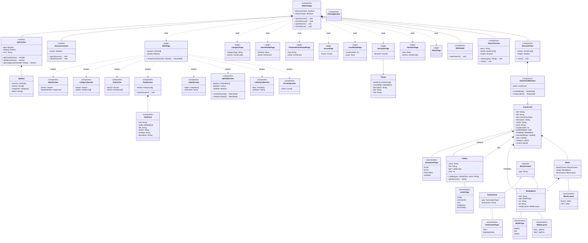

# Diyagram 3 — Website Frontend

```mermaid
classDiagram

%% ========================================
%% APP & CONTEXT
%% ========================================

class WebsiteApp {
    <<component>>
    - isDiscoverOpen: Boolean
    - isSearchOpen: Boolean

    + openDiscover(): void
    + closeDiscover(): void
    + openSearch(): void
    + closeSearch(): void
}

class ApiContext {
    <<context>>
    - data: ApiData
    - loading: Boolean
    - error: String

    + getFeedArticles(): Article[]
    + getMainSection(): Section
    + getCategorySection(title: String): Section
}

class ApiData {
    - sections: Section[]
    - articles: Article[]
    - categories: Category[]
    - labels: String[]
}

class DiscoverContext {
    <<context>>
    - isOpen: Boolean

    + openDiscover(): void
    + closeDiscover(): void
}

%% ========================================
%% PAGES
%% ========================================

class MainPage {
    <<page>>
    - sections: Section[]
    - loading: Boolean

    + renderSection(section: Section): ReactNode
}

class CategoryPage {
    <<page>>
    - categorySlug: String
    - articles: ArticleCard[]
}

class ArticleDetailPage {
    <<page>>
    - articleId: String
    - article: ArticleCard
}

class FeaturedArticleDetailPage {
    <<page>>
    - slug: String
    - article: ArticleCard
}

class IssuesPage {
    <<page>>
    - issues: Issue[]
}

class IssueDetailPage {
    <<page>>
    - issueNumber: Int
    - issue: Issue
}

class DosyalarPage {
    <<page>>
    - dosyalar: Dosya[]
}

class ThematicPage {
    <<page>>
    - slug: String
    - articles: ArticleCard[]
}

class AboutPage {
    <<page>>
}

%% ========================================
%% SECTION COMPONENTS
%% ========================================

class MainSection {
    <<component>>
    - section: Section
    - featuredArticle: ArticleCard
}

class CategorySection {
    <<component>>
    - section: Section
    - articles: ArticleCard[]
}

class ArticleLine {
    <<component>>
    - section: Section
    - articles: ArticleCard[]
}

class FeedSection {
    <<component>>
    - articles: ArticleCard[]

    + openDiscover(): void
}

class VideoSection {
    <<component>>
    - videos: VideoItem[]
    - channelUrl: String
}

class SpotifySection {
    <<component>>
    - playlists: PlaylistItem[]
    - profileUrl: String
    - isMobile: Boolean

    + renderFeatured(): ReactNode
    + renderCompact(): ReactNode
}

class LetterboxdSection {
    <<component>>
    - films: FilmItem[]
    - profileUrl: String
}

class ArchiveSection {
    <<component>>
    - issues: Issue[]
}

class DiscoverFeed {
    <<component>>
    - articles: ArticleCard[]
    - isOpen: Boolean

    + close(): void
}

%% ========================================
%% SHARED UI COMPONENTS
%% ========================================

class SiteHeader {
    <<component>>
    + openSearch(): void
}

class FloatingNavbar {
    <<component>>
}

class SearchOverlay {
    <<component>>
    - query: String
    - results: ArticleCard[]
    - isOpen: Boolean

    + search(query: String): void
    + close(): void
}

class ArticleCardElement {
    <<component>>
    - article: ArticleCard

    + renderMedia(): ReactNode
    + renderLabels(): ReactNode
}

class FeedCard {
    <<component>>
    - href: String
    - media: MediaBlock
    - title: String
    - source: String
    - timeAgo: String
    - description: String
}

%% ========================================
%% DATA TYPES (Website-side)
%% ========================================

class ArticleCard {
    - href: String
    - title: String
    - type: ArticleCardType
    - description: String
    - author: String
    - place: String
    - issueNumber: Int
    - publishedDate: Date
    - firstMedia: MediaBlock
    - twoLabelShown: Labelo[]
    - tags: Labelo[]
    - category: Labelo
    - content: Block[]
}

class ArticleCardType {
    <<enumeration>>
    SUNU
    ROTA
    FEATURED
    NORMAL
}

class Dosya {
    - articleList: ArticleCard[]
    - coverMedia: MediaBlock
    - description: String
    - title: String
    - href: String
}

class Labelo {
    - name: String
    - href: String
    - type: LabeloType
    - color: Int

    + Labelo(type: LabeloType, name: String)
    + getHexColor(): String
}

class LabeloType {
    <<enumeration>>
    NONE
    CATEGORY
    TAG
    THEMATIC
    FEATURED
}

class MediaBlock {
    - href: String
    - type: MediaType
    - src: String
    - alt: String
    - mediaLayout: MediaLayout
}

class MediaType {
    <<enumeration>>
    IMAGE
    GIF
    VIDEO
}

class MediaLayout {
    <<enumeration>>
    FULL_WIDTH
    TEXT_WIDTH
}

class Block {
    - blockContent: BlockContent
    - media: MediaBlock
    - blockLayout: BlockLayout
}

class BlockContent {
    <<abstract>>
    - type: String
}

class TextContent {
    - type: TextContentType
    - textContent: String
}

class TextContentType {
    <<enumeration>>
    TEXT
    SUBHEADING
}

class BlockLayout {
    <<enumeration>>
    RIGHT_SIDE
    LEFT_SIDE
}

%% ========================================
%% RELATIONSHIPS
%% ========================================

WebsiteApp "1" *-- "1" ApiContext
WebsiteApp "1" *-- "1" DiscoverContext
ApiContext "1" *-- "1" ApiData
WebsiteApp ..> MainPage : route
WebsiteApp ..> CategoryPage : route
WebsiteApp ..> ArticleDetailPage : route
WebsiteApp ..> FeaturedArticleDetailPage : route
WebsiteApp ..> IssuesPage : route
WebsiteApp ..> IssueDetailPage : route
WebsiteApp ..> DosyalarPage : route
WebsiteApp ..> ThematicPage : route
WebsiteApp ..> AboutPage : route
WebsiteApp "1" *-- "1" SiteHeader
WebsiteApp "1" *-- "1" SearchOverlay
WebsiteApp "1" *-- "1" DiscoverFeed

MainPage ..> MainSection : renders
MainPage ..> CategorySection : renders
MainPage ..> ArticleLine : renders
MainPage ..> FeedSection : renders
MainPage ..> VideoSection : renders
MainPage ..> SpotifySection : renders
MainPage ..> LetterboxdSection : renders
MainPage ..> ArchiveSection : renders

FeedSection "1" *-- "*" FeedCard
DiscoverFeed "1" *-- "*" ArticleCardElement
ArticleCardElement "1" --> "1" ArticleCard
DosyalarPage "1" --> "*" Dosya

ArticleCard "1" -- "1" ArticleCardType
ArticleCard "1" *-- "1" Labelo : category
ArticleCard "1" *-- "*" Labelo : tags
ArticleCard "1" *-- "0..1" MediaBlock : firstMedia
ArticleCard "1" *-- "*" Block

Block "1" *-- "0..1" MediaBlock
Block "1" -- "1" BlockLayout
BlockContent <|-- TextContent
BlockContent <|-- MediaBlock
TextContent "1" -- "1" TextContentType

Labelo "1" -- "1" LabeloType
MediaBlock "1" -- "1" MediaType
MediaBlock "1" -- "1" MediaLayout
```
